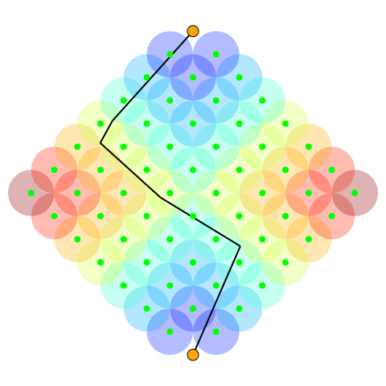
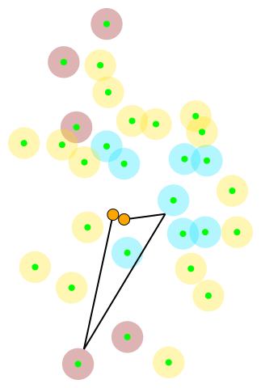

# Hopfield Neural Network for the Close Enough Orienteering Problem

This repository provides the solution of the Close Enough Orienteering Problem (CEOP) based on the Hopfield Neural Network (HNN). 
The method has been introduced in the article published at ITAT 2020 conference.

```
@article{deckerova@hopfield,
  title={Hopfield Neural Network in Solution of the Close Enough Orienteering Problem},
  author={Jindri{\v{s}}ka Deckerov{\'a}, Jan Faigl},
  booktitle={Proceedings of the 20th Conference Information Technologies - Applications and Theory (ITAT 2020)},
  year={2020}
}
```

## CEOP examples



## How to run HNN
The provided codes are in C++11 and utilize CRL (https://github.com/comrob/crl). 
To run the code, first run [install.sh](install.sh) to install CRL, and then run [example.sh](example.sh):

```
make && ./thnn_ceop \
  --problem=etc/tsiligirides_problem3/tsiligirides_problem_3_budget_050.txt \
  --communication-radius=1 \
  --heuristic=socp \
  --compute-matrix=0 \
  --iterations=10 \
  --repetitions=20
```

All possible configuration flags can be displayed by `./thnn_ceop -h`. 
